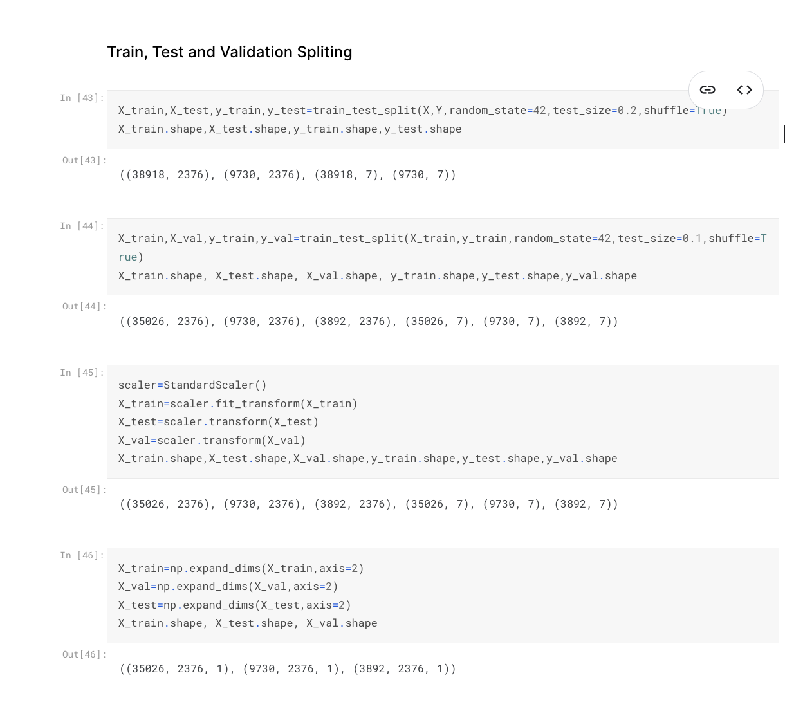
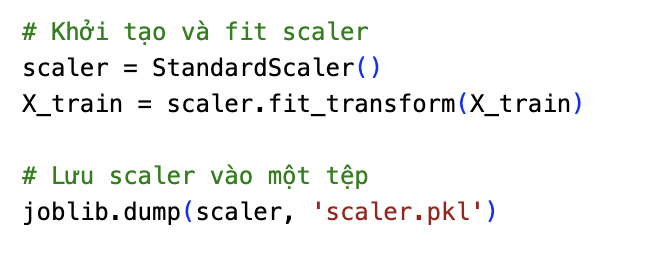

https://www.kaggle.com/code/lkergalipatak/speech-emotion-recognition-with-cnn/notebook#Including-Analyzed-Audio-Features

### Chức năng của file
###### [[get_scaler.py]]
- là file để lấy scaler của dữ liệu cũ để sau này chuẩn hoá lại dữ liệu file ghi âm của mình


Còn đây là code của anh



Phần xử lý scaler copy thẳng từ kaggle thôi, không có gì cả

##### [[prediction.py]]
- file này thì ta dùng scaler đã load từ file [[get_scaler.py]], và load mô hình h5 lên dùng thôi

``` python
    features = np.expand_dims(np.array(features), axis=2)
```
- vì dữ liệu yêu cầu mảng 3 chiều, nên axis = 2 nghĩa là thêm 2 chiều vào mảng -> 3

``` python
    predicted_index = np.argmax(predictions)
```
- chạy mô hình, nó sẽ trả về mảng, phần tử nào lớn nhất là có xác xuất ở emotion đó cao nhất, nên ta dùng argmax

##### [[getfeature.py]]
- Cũng copy lại từ kaggle, vì đây là bước xử lý âm thanh thành số, nên phải dùng code y hệt trên kaggle, chỉ khác là trên kaggle, 1 file âm thanh nó sẽ sinh ra thêm 4 biến thể, nhưng chúng ta không cần, chỉ cần dự đoán file hiện tại thôi

##### [[main.py]]
- hàm record là ghi âm real-time, cứ mỗi 3.5 giây nó sẽ in ra cảm xúc 1 lần
- khi chạy, nó sẽ in ra "talk now", lúc ấy ta có thể bắt đầu nói được(vì code chạy mất mấy giây, nên phải in ra như vậy để biết khi nào code thực sự ghi âm) 
- ấn control + c để dừng chương trình


<span style="color:red"> *file **processed_data.csv** khá nặng, không đưa lên github được, có thể tải lại từ em Hải* </span>.
